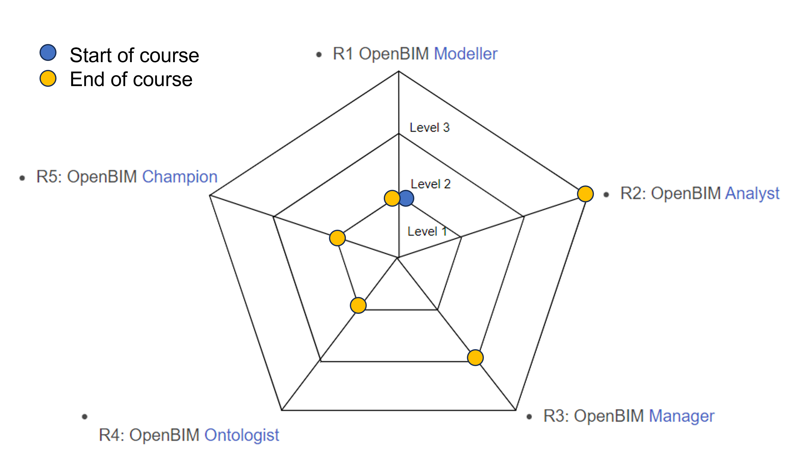

# Project Reflection

## Learning experience for the concept

At the beginning of this course, it was only possible to make a BIM model in a closed software, and we had no in depth knowledge of IFC or OpenBim software. 
There has been a development in the knowledge which can be seen in the figure below: 

 

The progression can for example be seen in the ability to extract the data for the tool from an Ifc model, which was not possible at the start of the course. The understanding of property- and quantity sets were further expanded when adding data to the model and construct property sets ourselves and alter existing data. 
The importance of data exchange between other professions or data sources and the data formats was also better understood from the creation of the BPMN diagram and description of the necessary inputs and outputs of the model. To do this in an accessible way, it was not defined in python. A material library outside of python was not obtained, but the intentions were there. Between Assignment 2 and Assignment 3 the tool was also developed a lot, by for example calculating areas and volumes of spaces which did not already have pre-defined vaues in ifc, and had been a hindrance for the tool to calculate on all the spaces. Improved coding skills during the course meant some aspects of the tool could have been simplified.

It is still necessary to further master other elements of OpenBim and the advanced BIM environment. The main understanding from the course is based on the Ifc structure and IfcOpenShell, but the ability to use other tools and understand ontology further is in the future learning scope. 

Now knowing the potential of open BIM, it can continue to be used moving forward to develop tools when there are not current exisiting ones for a particular purpose. Additionally it enables the tools to be developed by many people so that very efficient iterations may happen. 

## Proces of developing the tool

The process of developing the tool was in no way linear and was paved with having to overcome obsatcles both rooted in coding/implementation in python, understanding the abilities of IfcOpenShell, and utilizing the structure of Ifc. The tool was produced from a trial-and-error basis while also trying to achieve basic milestones and progress to maintain a trajectory. The necessary self-learning forced a more in depth understanding of OpenBim and the Ifc structure. The construction of the tool also pushed us to relate to how to convey the end results of the tool to the end user by making plots, lists, output files and print statements in order to undertand the mechanics and performance of the tool and the results. The process of developing this tool certainly provided insights for how building design may be improved and what application may be applicable for a thesis topic. Ifc and Open BIM provide a framework for solving problems being faced in early design stages.

For the use case, it was beneficial to independently decide what to dive into since the tool can be more passion driven and expanded more based on curiosity. Had the possibilites been more limited, the willingness to expand and work with the tool may have been minimized due to a lacking interest. Alternatively, more initial feedback on the choice of use case and scoping of the use case would have been beneficial to be assured that the case was valid, useful, and sufficiently in-depth.   

The number of tools provided was sufficient but it could be beneficial to open up the possibility of tools for student who may have a particular focus on something besides python scripting. However, using these tools as a guiding framework provided a level of structure.

## Feedback of the tutorial

Based on feedback, the tool addressed the use case and was useful for the relevant OpenBim role. The use case was generally thought to be very well and extensively modeled. The tutorial format was however too long, losing the attention of learner. The explanation of the user-based input to the console could have been showcased further, since it was not fully understood how it functioned. The walk-through of the script and intro was however found very useful, and the script was understood by the reviewing parties. Further improvements or expansion of the tutorial could include a written instruction of the script, but since the .py file was out-commented, it was found useful in and of itself. The agenda and scope of the tool was very clear. It served a clear function to designers in terms of better understanding IAQ early in the design process to help achieve healthier building design.

## Future for advanced use of OpenBim

It is very likely to be used in further in our professional lives, since the potential is unlimited and possible to use to ease workstreams. By understanding the underlying structure of IFC and the broader understanding of OpenBIM and information storage and structure makes it possible to retrieve the needed data and possibly implement it in simpler tools. It's expected that for bigger coorporations to have more designated programmers that design the tools, but by understanding the power and limitations of a tool and data, it makes it possible to give inputs, alter or any thing else. It's also expected that we would get in touch with OpenBim when exchanging data with other parties. IFC and OpenBIM are tools that can be utilized in many disciplines within building design. In a similar way to how digital building models revolutionized the design process, OpenBIM and IFC are a new space that as it continues to develop with help shift the way early design decisions are made.

## Conclusion

In conclusion, the course had a steep learning curve but provided a lot of freedom to develop a tool within our scope of interest. Each assignment clearly built on the previous. The course in many ways forced self-learning if there was motivation to develop a relevant and significant tool. Overall, there was a lot learned but there remains much more.